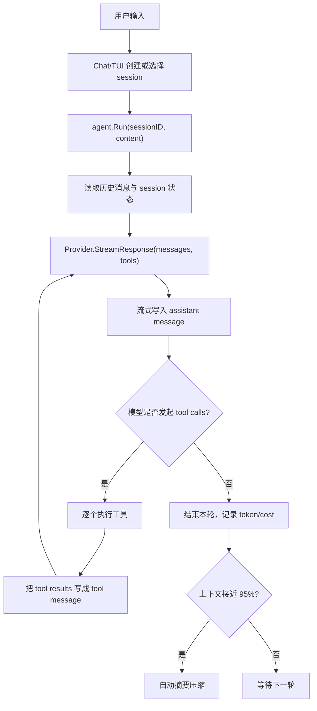
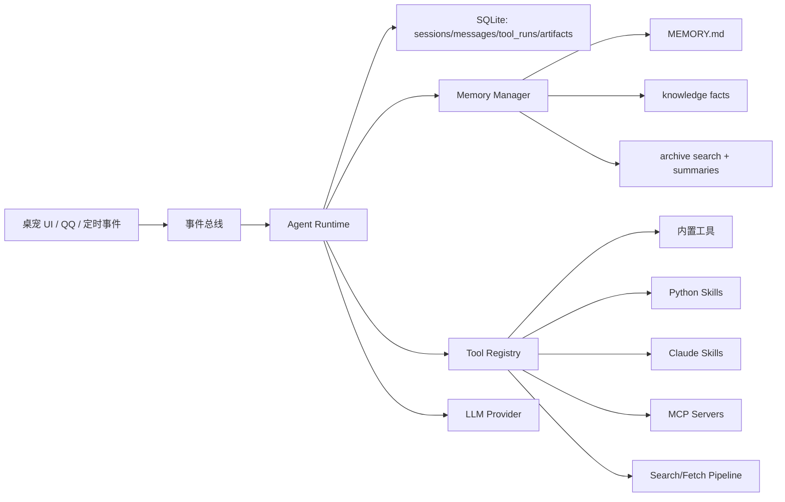

# OpenCode Agent 工作方式研究与桌宠 Agent 改造建议

本文基于本目录下 `opencode-main` 源码整理，重点关注三件事：记忆、搜索/网页内容获取、工具与插件调用。最后给出对当前桌宠 Agent 的技术路线建议。

## 1. 总体架构

OpenCode 是一个 Go 写的终端 Agent。核心链路是：



关键文件：

- `opencode-main/internal/llm/agent/agent.go`：主 Agent 循环、取消、摘要、token/cost 追踪。
- `opencode-main/internal/llm/provider/*`：不同模型供应商适配，统一成 `ProviderEvent`。
- `opencode-main/internal/llm/tools/*`：内置工具。
- `opencode-main/internal/session`、`internal/message`、`internal/history`：SQLite 持久化。
- `opencode-main/internal/llm/agent/mcp-tools.go`：MCP 插件工具接入。

OpenCode 的设计很像一个“有数据库的 function calling ReAct 循环”：模型流式输出，遇到工具调用就暂停回答、执行工具、把结果喂回模型，再继续。

## 2. 记忆机制

OpenCode 的记忆不是向量库式长期记忆，而是四层较朴素但可靠的上下文系统。

第一层：项目记忆文件。

`prompt.GetAgentPrompt()` 会读取配置里的 `contextPaths`，默认包括：

- `.github/copilot-instructions.md`
- `.cursorrules`
- `.cursor/rules/`
- `CLAUDE.md`
- `opencode.md`
- `OpenCode.md`
- 以及 local/大写变体

读取到的内容会拼进系统提示词的 `Project-Specific Context`。其中 `OpenCode.md` 的定位是项目级长期记忆，存构建命令、测试命令、代码风格、项目结构等。

第二层：会话与消息持久化。

OpenCode 使用 SQLite，默认路径是 `.opencode/opencode.db`。表包括：

- `sessions`：标题、父会话、token、cost、summary_message_id。
- `messages`：每条 user/assistant/tool 消息，消息内容被拆成 typed parts。
- `files`：文件变更历史。

消息结构支持 `text`、`reasoning`、`tool_call`、`tool_result`、`finish`、`binary` 等部分，因此一轮工具调用可以完整复盘。

第三层：上下文压缩摘要。

当 TUI 收到本轮 Agent 完成事件后，会检查：

```text
prompt_tokens + completion_tokens >= model.context_window * 0.95
```

且 `autoCompact=true` 时，自动调用 `CoderAgent.Summarize()`。

摘要流程是：读取当前 session 全部消息，加一个“请总结对话”的用户提示，用 summarizer agent 生成摘要，然后把摘要保存为一条 assistant message，并把 session 的 `summary_message_id` 指向这条摘要。之后新一轮对话只取从这条摘要开始的消息，并把摘要消息角色改成 user 注入上下文。

这是一种“滚动摘要锚点”设计，简单有效，但不是可检索记忆。

第四层：文件变更历史。

`write/edit/patch` 工具会把修改前后的文件内容写入 `files` 表，形成 session 内的版本历史，供侧栏展示改动，也为回滚/审阅打基础。

## 3. 搜索与网页内容获取

OpenCode 的搜索分三类。

本地代码搜索：

- `glob`：找文件名，优先用 `rg`，回退到 doublestar。
- `grep`：搜文件内容，优先用 `rg -H -n`，回退到 Go 正则遍历。
- `ls`：目录树。
- `view`：读取文件，带行号、大小限制、长行截断、LSP diagnostics。

公共代码搜索：

- `sourcegraph`：调用 `https://sourcegraph.com/.api/graphql`，搜索公共仓库代码，返回仓库、文件、URL、命中行和上下文。

网页内容获取：

- `fetch`：只支持 HTTP/HTTPS GET。
- 输出格式支持 `text`、`markdown`、`html`。
- HTML 转纯文本用 `goquery`，转 Markdown 用 `html-to-markdown`。
- 最大响应体 5MB。
- 需要权限确认。
- 不支持登录、Cookie、JS 渲染、浏览器自动化。

一个重要结论：OpenCode 本身没有通用搜索引擎式 `web_search`。它能抓某个 URL，也能用 Sourcegraph 搜公共代码，但不能像 Perplexity/Tavily 那样直接“搜全网并综合”。你的桌宠当前 `smart_search`、`pro_search`、`fetch_webpage` 在联网搜索方向反而更强。

## 4. 工具调用机制

OpenCode 把所有工具统一成：

```go
type BaseTool interface {
    Info() ToolInfo
    Run(ctx context.Context, params ToolCall) (ToolResponse, error)
}
```

`Info()` 返回工具名、描述、JSON Schema 参数、required 字段。Provider 层会把这些工具转成 OpenAI / Anthropic / Gemini 等各家的 tool schema。

主循环在 `agent.streamAndHandleEvents()` 中做这些事：

1. 创建空 assistant message。
2. 流式接收 provider event。
3. 内容 delta 写入 message。
4. tool use start/stop 写入 message。
5. complete 后拿到最终 tool calls。
6. 按工具名匹配 `a.tools`。
7. 执行工具。
8. 把所有 tool results 创建成一条 `role=tool` 的消息。
9. 如果 finish reason 是 `tool_use`，把 assistant message 和 tool message 加回上下文，继续下一轮。

权限模型：

- `bash`、`fetch`、`write/edit/patch`、MCP 工具等敏感操作会请求权限。
- 用户可允许一次、允许本 session、拒绝。
- 非交互模式会 `AutoApproveSession()`，全部自动批准。
- `bash` 有 banned commands 和 safe read-only commands。
- 文件写入工具要求“先 read 再 edit/write”，并检查文件读取后是否被外部修改过。

值得注意的差异：

- OpenCode 的多个 tool calls 在源码里是顺序执行的。
- 你的桌宠 `ChatWorker` 已经用 `ThreadPoolExecutor` 并行执行多个工具调用，这点比 OpenCode 更适合搜索、读多个文件、并发抓网页。

## 5. 插件与扩展

OpenCode 有两类扩展。

第一类：MCP。

配置在 `.opencode.json` 的 `mcpServers` 中，支持：

- `stdio`：启动本地 MCP server，通过标准输入输出通信。
- `sse`：连接远端 SSE MCP server，可带 headers。

启动时 `GetMcpTools()` 会连接 MCP server，`ListTools()` 自动发现工具，然后包装成 OpenCode 工具。命名规则是：

```text
<mcpServerName>_<toolName>
```

调用时会先弹权限，再初始化 MCP client，反序列化模型传入参数，执行 `CallTool()`，最后把 MCP content 转成文本返回。

第二类：Custom Commands。

OpenCode 会扫描：

- `$XDG_CONFIG_HOME/opencode/commands/`
- `$HOME/.opencode/commands/`
- `<project>/.opencode/commands/`

每个 Markdown 文件变成一个命令，可以带 `$NAME` 形式的命名参数。执行命令本质上是把 Markdown 内容作为用户消息发给 Agent。这不是工具插件，更像“提示词宏”。

对比你的桌宠：

- 你已有 Python function-calling skill：`skills/*.py` 导出 `SKILL` 和 `run(args, ctx)`。
- 你已有 Claude Skill 兼容：`skills/<name>/SKILL.md`，先加载 name/description，按需 `load_skill_instructions` 读取完整说明。
- OpenCode 的 MCP 接入值得借鉴；你的 Python skill 更适合本地快速扩展，二者可以并存。

## 6. 对当前桌宠 Agent 的观察

当前桌宠已经具备不少 OpenCode 同类能力：

- `ChatWorker` 有 ReAct 循环、流式输出、工具调用、取消、自动续写。
- `ToolExecutor` 有工具注册表和外部 skill fallback。
- `MEMORY.md`、`knowledge.json`、`conversation_archive.jsonl` 已经构成项目记忆、结构化事实记忆、长期对话检索。
- `smart_search` 已有多源并发、缓存、降级、域名质量排序，并会记录搜索到/正文读取成功/正文读取失败的 URL。
- `fetch_webpage` 能抓网页正文，会先规范中文 URL，并对 B 站等站点做 API 特化；B 站可额外读取热门评论，普通网页会尽量提取已渲染的可见评论/讨论区。
- `core.search_links` + 聊天面板 `链` 按钮已经提供轻量链接审计，用户可以在聊天窗口复盘 agent 查过和抓取失败的来源。

主要短板在工程化层面：

- 会话、消息、工具调用、工具结果还没有像 OpenCode 那样结构化入库，复盘和调试会吃力。
- 工具结果主体仍是纯字符串；搜索/fetch 已先补了轻量 URL metadata 日志，但还没有统一的 `{content, is_error, metadata}` 工具结果协议。
- 记忆召回使用 bigram-IDF，足够轻量，但缺少“摘要记忆”和“可编辑记忆审计”。
- 插件目前偏 Python 本地模块，缺少 MCP 这类跨语言协议。
- 权限策略有弹窗，但缺少按 session/path/tool/action 维度的结构化授权缓存。
- 配置中不建议明文保存 API key，后续最好迁移到环境变量、系统凭据或本地加密存储。

## 7. 推荐技术路线

### 阶段一：先把 Agent 内核结构化

目标：不大改 UI，先让每轮运行可复盘。

建议新增或改造：

- `sessions`：一次连续对话或任务。
- `messages`：user/assistant/tool/system_event。
- `message_parts` 或 JSON parts：text、reasoning、tool_call、tool_result、attachment、finish。
- `tool_runs`：tool_name、args、result、metadata、duration、status、permission_id。
- `artifacts`：文件、网页正文、搜索结果、截图等。

这样你后续做“记忆、调试、重放、性能分析、工具失败回溯”都会轻很多。

### 阶段二：升级记忆为三层模型

建议保留你已有能力，但分层更清楚：

- 项目/人格记忆：`MEMORY.md`，人工可编辑，最高优先级。
- 用户事实记忆：`knowledge.json` 或 SQLite 表，保存偏好、称呼、常用路径、长期约束。
- 会话记忆：完整消息入库 + 自动摘要 + 检索召回。

推荐新增：

- `session_summary`：每 N 轮或 token 超阈值生成滚动摘要。
- `memory_candidates`：模型想保存的记忆先进入候选区，用户批准后写入长期记忆。
- `memory_source`：每条记忆记录来源消息、时间、置信度、最后使用时间。

向量库可以放到第二步之后。先用你现有 bigram-IDF 加摘要就能明显改善。

### 阶段三：把搜索拆成 Search -> Fetch -> Synthesize

建议把联网能力拆成三个稳定工具：

- `web_search(query, mode, recency, domain)`：只返回结构化结果列表，不直接长篇回答。
- `fetch_url(url, format, max_chars)`：抓正文，返回标题、URL、正文、状态码、截断信息。
- `source_rank(results)`：按官方/学术/文档/社区/低质站点排序。

回答时强制模型遵守：

- 搜索摘要不够时必须 fetch 原网页。
- 高风险事实必须交叉验证。
- 最终回答附来源 URL。

你现在的 `smart_search` 很强，下一步重点是把输出结构化，不只返回字符串。

当前最小落地版已经先做了轻量 Search/Fetch 审计：`smart_search` 和 `fetch_webpage` 会把 URL 写入 `data/search_links.json`，聊天面板右下 `链` 按钮展示搜索到、读取成功、读取失败三类链接。后续若继续推进完整结构化，可以把这份链接日志迁入 `tool_runs/artifacts`，并把每次 fetch 的 HTTP 状态码、截断状态、正文长度、评论读取状态都作为 metadata 持久化。

### 阶段四：工具系统标准化

建议定义统一的 Python 协议：

```python
class ToolSpec(TypedDict):
    name: str
    description: str
    parameters: dict
    permission: str | None

class ToolResult(TypedDict):
    content: str
    is_error: bool
    metadata: dict
```

工具执行器负责：

- JSON Schema 校验。
- 超时和取消。
- 并发调度。
- 权限请求。
- 结果截断。
- 结构化日志。
- 给 UI 发 tool_started/tool_finished 事件。

文件工具建议借鉴 OpenCode：

- 修改前必须读文件。
- 写入前检查文件是否被外部修改。
- 写入前生成 diff 给用户批准。
- 每次写入保存旧版本和新版本。

### 阶段五：插件体系双轨制

建议保留你当前的 Python skill，并新增 MCP：

- Python Skill：适合本地桌宠能力，比如日程、QQ、系统操作、文件处理。
- Claude Skill：适合长说明、流程化任务、写作/论文/PDF 等按需加载。
- MCP Server：适合接入外部生态，比如浏览器、GitHub、数据库、知识库、自动化工具。

插件清单建议做成：

```text
name
type: builtin | python_skill | claude_skill | mcp
description
permissions
enabled
source_path/server_config
trust_level
```

UI 上可以做一个“技能中心”：启用/停用、查看权限、热重载、测试调用。

## 8. 最值得直接借鉴的 OpenCode 设计

可以直接借鉴：

- Agent 主循环里的消息持久化和 tool result 回填。
- `OpenCode.md` 这种项目级记忆文件。
- 自动摘要压缩，用 summary message 作为新上下文锚点。
- 工具统一接口 `Info()/Run()`。
- 文件修改前的读写时间检查。
- diff + 权限批准。
- MCP 自动发现工具。
- 非交互/自动批准模式，适合后台任务。

不建议照搬：

- `bash` 的 persistent shell 实现偏 Unix，在 Windows 桌宠里要重写。
- OpenCode 没有真正 web search，你已有更好的搜索模块。
- 工具串行执行不适合桌宠的网页搜索和多文件读取。
- 仅靠摘要压缩无法替代长期记忆检索。

## 9. 一个适合桌宠的目标架构



核心思想：UI 只负责呈现和交互，Agent Runtime 负责循环、状态、消息、工具、权限；Memory/Search/Plugin 都是可替换模块。

## 10. 优先级建议

第一优先级：

- 建 SQLite 消息与工具调用日志。
- 工具结果改成 `{content, is_error, metadata}`。
- 加 session rolling summary。
- 文件写入加 diff 预览和版本记录。

第二优先级：

- 搜索结果结构化，并让 `fetch_webpage` 接收搜索结果 URL。
- 长期记忆候选审批。
- 插件/skill 管理 UI。
- 工具并发调度增加“只读工具可并发、写工具串行”的规则。

第三优先级：

- MCP 接入。
- Playwright/浏览器工具，用于登录态网页、动态网页、截图。
- 向量记忆库。
- 多 agent 分工，例如“搜索 agent”“代码阅读 agent”“执行 agent”。

如果只做一个最小可行版本，我建议先做“结构化会话库 + 滚动摘要 + 结构化工具结果”。这三件事会立刻提升稳定性，也会让后面的记忆和插件系统有地基。
